# **Cài đặt tiện ích:** 
    Đảm bảo bạn đã cài đặt extension **Selenium IDE** trên trình duyệt Chrome hoặc Firefox hoặc Microsoft Edge.

# Màn hình chào mừng

Khi khởi chạy IDE, bạn sẽ thấy một hộp thoại chào mừng.
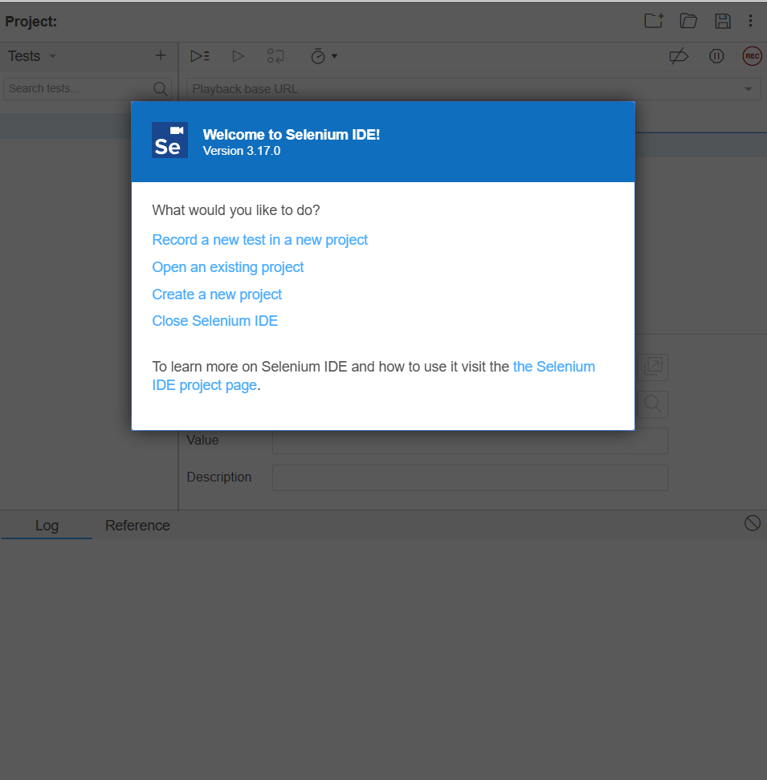

Điều này sẽ cung cấp cho bạn quyền truy cập nhanh vào các tùy chọn sau:

- Ghi lại một thử nghiệm mới trong một dự án mới  
- Mở một dự án hiện có  
- Tạo dự án mới  
- Đóng IDE  

Nếu đây là lần đầu tiên bạn sử dụng IDE (hoặc bạn đang bắt đầu một dự án mới), thì hãy chọn tùy chọn đầu tiên.

---

# Ghi lại bài kiểm tra đầu tiên của bạn

Sau khi tạo một dự án mới, bạn sẽ được nhắc:

- Đặt tên cho dự án  
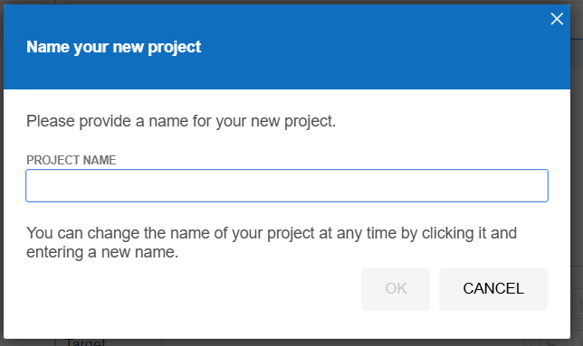
- Cung cấp **URL cơ sở**
  
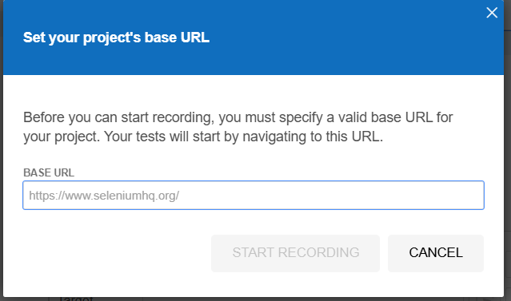

**URL cơ sở** là URL của ứng dụng bạn đang thử nghiệm.  
Bạn chỉ cần đặt một lần và nó sẽ được sử dụng trong tất cả các bài kiểm tra trong dự án. Bạn có thể thay đổi nó sau nếu cần hoặc có thể bỏ qua.

Sau khi hoàn tất:

- Một cửa sổ trình duyệt mới sẽ mở ra  
- URL cơ sở được tải  
- Quá trình ghi bắt đầu  

 Tương tác với trang và mỗi hành động của bạn sẽ được ghi lại trong IDE.  

Để dừng ghi:
- Chuyển sang cửa sổ IDE  
- Nhấp vào biểu tượng ghi  

---

# Tổ chức các bài kiểm tra của bạn

## Kiểm tra (Tests)

Bạn có thể thêm một thử nghiệm mới bằng cách:

1. Nhấp vào biểu tượng `+` ở đầu menu thanh bên trái  
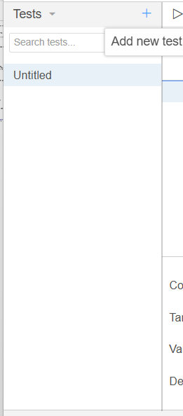
2. Đặt tên  
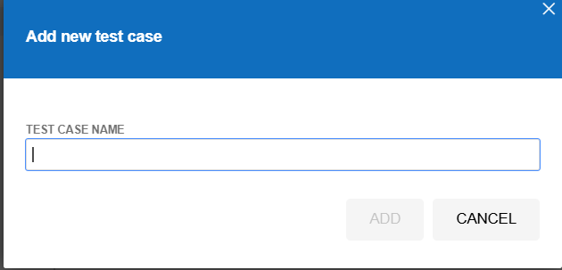
3. Nhấp `.ADD`  

Sau khi thêm, bạn có thể:
- Nhập lệnh thủ công  
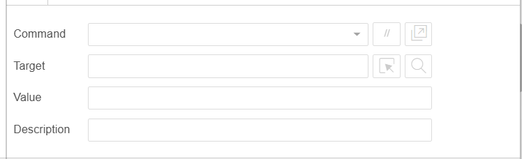
- Hoặc nhấp vào biểu tượng ghi màu đỏ ở trên cùng bên phải IDE  
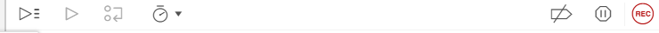
---

## Bộ kiểm tra (Test Suites)

Các bài kiểm tra có thể được nhóm lại thành các bộ.  

Để quản lý bộ:
1. Nhấp vào menu thả xuống ở đầu thanh bên trái  
2. Chọn **Test suites**

---

## Thêm một bộ

Để thêm bộ:

1. Nhấp vào biểu tượng `+` bên phải tiêu đề  
2. Nhập tên  
3. Nhấp `.ADD`  

---

## Thêm thử nghiệm vào bộ

1. Di chuột qua tên bộ  
2. Nhấp biểu tượng bên phải tiêu đề  
3. Chọn **Add tests**  
4. Chọn các bài kiểm tra  
5. Nhấp **Select**  

---

## Xóa thử nghiệm

- Di chuột qua thử nghiệm  
- Nhấp biểu tượng `X` bên phải  

---

## Xóa hoặc đổi tên bộ

### Xóa bộ
1. Nhấp biểu tượng bên phải tên  
2. Nhấp **Delete**  
3. Xác nhận lại  

### Đổi tên bộ
1. Di chuột qua tên bộ  
2. Nhấp biểu tượng bên phải  
3. Chọn **Rename**  
4. Cập nhật tên  
5. Nhấp **RENAME**  

---

# Lưu công việc của bạn

Để lưu:

- Nhấp biểu tượng **Save** ở góc trên bên phải  

Bạn sẽ được yêu cầu:
- Chọn vị trí lưu  
- Đặt tên file  

 Kết quả: file có đuôi `.side`

---

# Phát lại (Playback)

## Trong trình duyệt

Bạn có thể chạy lại các bài kiểm tra:

1. Chọn bài kiểm tra hoặc bộ  
2. Nhấp nút **Play** trên thanh công cụ  

 Kết quả:
- Bài kiểm tra sẽ chạy trong trình duyệt  
- Nếu cửa sổ ghi vẫn mở → dùng lại  
- Nếu không → mở cửa sổ mới  
``
# Thực hiện ví dụ
TC03: bỏ trống 2 trường nhập

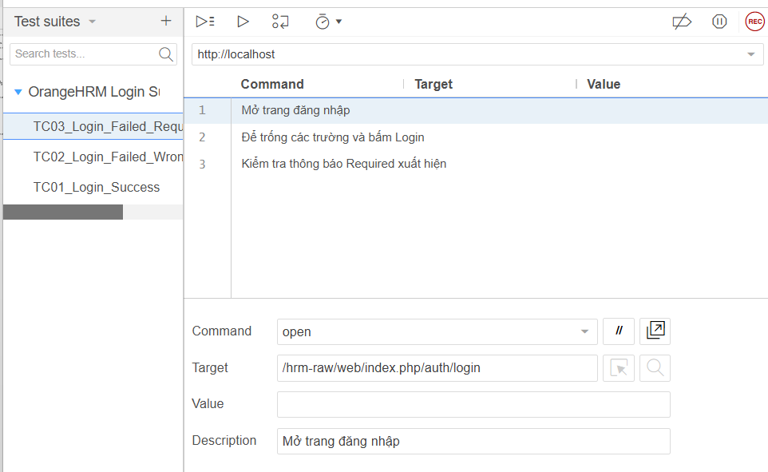

TC02: nhập sai trường mât khẩu

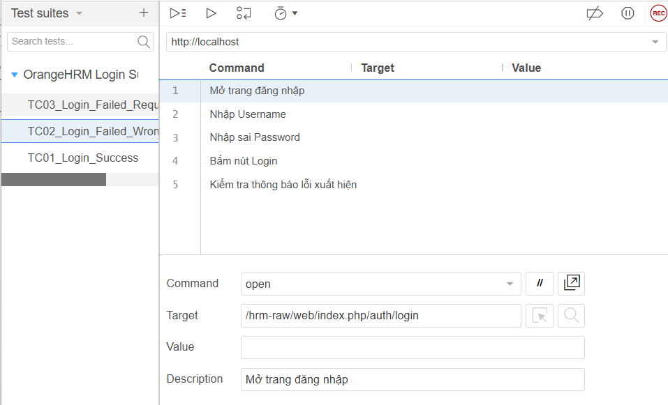

TC01: nhập đúng cả 2 trường

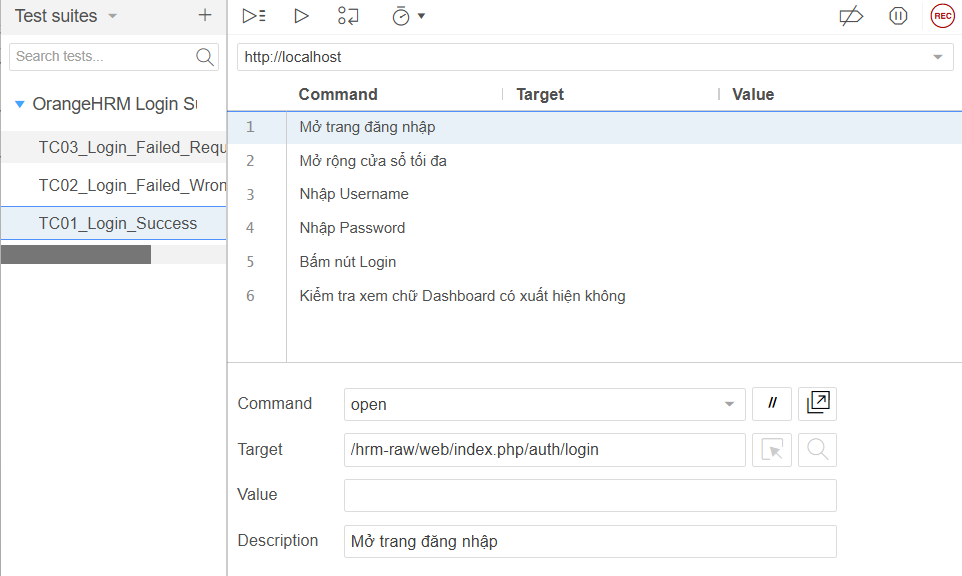

Kết quả:

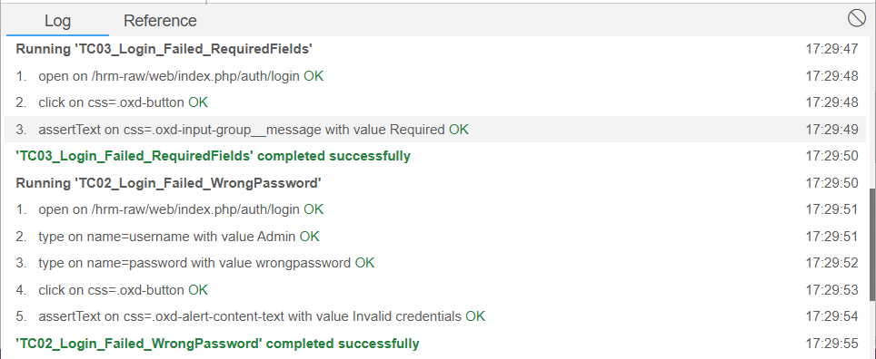
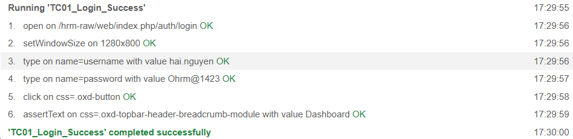
